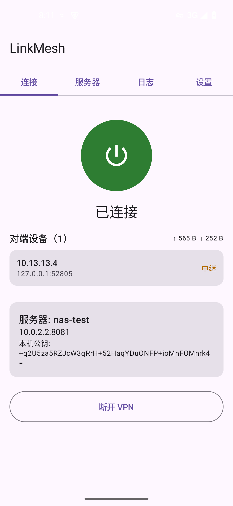
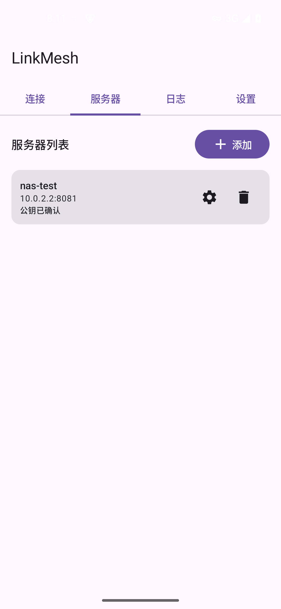
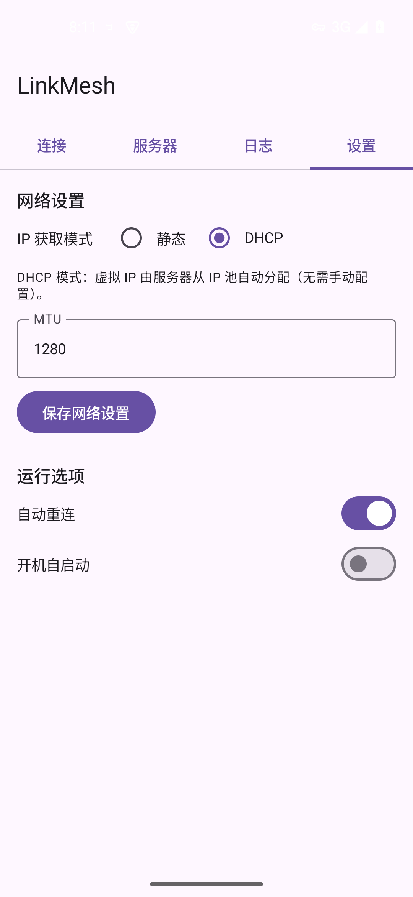
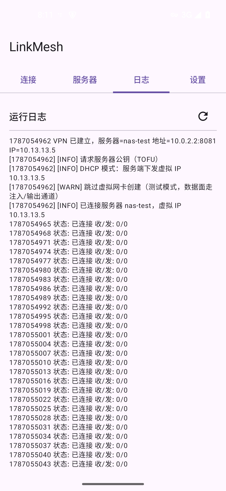

# LinkMesh — 可以在多个操作系统上运行的内网穿透工具

LinkMesh 是一个 Rust 编写、端到端加密的 **NAT 穿透 VPN**：一台中心服务器负责信令交换与数据面中继（只转发密文、不解密），
客户端之间优先 **UDP 打洞直连**，打洞失败自动降级 **中继**；支持 **Linux / Windows / Android** 三端。



## 核心特性

- **NAT 穿透**：UDP 打洞优先，失败自动降级中继；打洞禁用 = 全程中继（严格语义）。
- **端到端加密（PFS）**：数据面 ChaCha20-Poly1305，会话含临时路由密钥 rk（3-DH/`HKDF`），
  密钥用后即清零；静态密钥泄露无法解密历史流量。
- **身份认证与吊销**：mesh 网格根（Ed25519）签发设备证书 / ServerInfo / CRL；
  一次性 TOFU 网格根指纹后全部签名离线可验证；吊销立即踢会话。
- **默认拒绝**：未授权设备不能注册 / 查询 / 中继；授权绑定虚拟 IP（防 IP 抢占）。
- **房间令牌验证**：服务器配置若干房间令牌（只存 SHA-256），
  设备先输入令牌才能入网；令牌决定房间，**不同房间互相隔离**（查询 / 中继 / 通知 / 别名均不可见）。
- **别名解析**：给设备定义别名（如 `computer`）后，任意应用可直接 `computer:8080` 访问，
  无需手写虚拟 IP（服务端别名表 + 客户端内嵌 DNS 应答器 + `--resolve`）。
- **断线自动重连**：连接异常退出后按 `reconnect_secs` 自动重连（0 = 关闭），Linux/Windows 与 Android 对齐。

  

## 快速开始

### 1. 启动服务器

```bash
# 生成服务端密钥（X25519 + Ed25519 + 控制通道令牌）
linkmesh-server --genkey

# 可选：配置房间令牌（分房间隔离；不配置 = 单房间开放，启动会有警告）
linkmesh-server --add-room office "my-office-token"

# 可选：绑定设备别名（同房间客户端即可用 computer:8080 访问 10.13.13.5）
linkmesh-server --alias computer 10.13.13.5

# 启动（默认 8080 端口）
linkmesh-server --start 8080
```

### 2. 加入并连接（Linux / Windows）

```bash
# 每台设备生成自己的设备身份（私钥绝不上传）
linkmesh-client --genkey

# 新建虚拟网卡（IP 为证书绑定 IP 的占位，认证后自动覆盖）
linkmesh-client --newvmnic linkmesh0 --ip 10.13.13.5

# 配置服务器
linkmesh-client --newserver 1.2.3.4:8080 "my-server"

# 连接（服务器启用了令牌验证时用 --token；需先 --join 加入网格）
linkmesh-client --connect "my-server" "linkmesh0" --token my-office-token
```

网格认证（mesh，强制）：服务器需先 `--mesh-init` 初始化，管理员签发加入码，客户端 `--join` 加入换取设备证书：

```bash
linkmesh-client --join "my-server" "linkmesh0" --code LMJ-XXXX-XXXX --token my-office-token
linkmesh-client --connect "my-server" "linkmesh0" --token my-office-token
```

### 3. 使用别名

```bash
# 解析别名
linkmesh-client --resolve computer        # → computer -> 10.13.13.5

# 内嵌 DNS 应答器（默认 udp 127.0.0.1:5353）：把系统 DNS 指向它后，直接访问：
#   curl http://computer:8080/
#   （只解析网格内已知别名，不向上游转发；别名仅同房间可见）
```

设备也可自报别名：本地 `client.json` 的 `aliases` 中若存在「名称 → 本机虚拟 IP」的条目，
该名称会自动随注册/心跳自报给服务器：

```bash
linkmesh-client --alias computer 10.13.13.5   # 10.13.13.5 是本机虚拟 IP 时自动自报
```

### 4. 断线自动重连

`client.json` 中配置 `reconnect_secs`（默认 5 秒，0 = 不自动重连）：

```jsonc
{ "reconnect_secs": 5 }
```

连接异常退出（服务器不可达 / 认证失败等）后守护进程按该间隔自动重连；
`--disconnect` / `--stop` 会立即中断重连循环。未配置房间令牌且服务器要求令牌时，
`--connect` 会在启动前直接拒绝（不会后台空转重连）。

## 命令速览

- **服务器**：`--genkey` `--start` `--stop` `--mesh-init` `--invite` `--issue` `--revoke` `--crl`
  `--add-room` `--remove-room` `--rooms` `--alias` `--alias-del` `--alias-list`
  `--show-fingerprint` `--list` `--delpeer` `--status` `--log`
- **客户端**：`--genkey` `--showpubkey` `--fingerprint` `--join` `--newvmnic` `--delvmnic`
  `--newserver` `--connect` `--disconnect` `--stop` `--alias` `--alias-del` `--alias-list`
  `--resolve` `--list` `--status` `--log`

详见 [docs/linkmesh-server 基础命令.md](docs/linkmesh-server%20基础命令.md) 与
[docs/linkmesh-client 基础命令.md](docs/linkmesh-client%20基础命令.md)。

## 安全模型

- **信任一次，验证永远**：加入时 TOFU 网格根指纹（支持 `-y/-n`），此后一切凭 Ed25519 签名链离线验证。
- **前向保密**：3-DH 会话密钥 + 临时 rk + 用后清零；中继头部只暴露短期 rk，不暴露长期身份。
- **默认拒绝 + 房间隔离**：未授权/无令牌设备无法注册、查询、中继；令牌房间之间完全隔离。
- **防重放**：握手期 nonce 缓存 + 时间戳窗；会话期递增计数器确定性 nonce；数据面 epoch+seq。
- **别名安全**：名称强校验；解析仅限同房间；管理员别名优先于设备自报（防抢占命名）。

设计文档见 [docs/身份认证与密钥管理体系设计.md](docs/身份认证与密钥管理体系设计.md)，
安全测试见 [test-results/linkmesh-安全审计与传输测试报告.md](test-results/linkmesh-安全审计与传输测试报告.md)、
[test-results/linkmesh-三端加固与测试报告.md](test-results/linkmesh-三端加固与测试报告.md)、
[test-results/linkmesh-令牌房间别名与重连测试报告.md](test-results/linkmesh-令牌房间别名与重连测试报告.md)、
[test-results/linkmesh-压力与故障测试报告.md](test-results/linkmesh-压力与故障测试报告.md) 与
[test-results/linkmesh-Windows压力与随机故障测试报告.md](test-results/linkmesh-Windows压力与随机故障测试报告.md)。

## 构建

> 无论目标平台是 Windows 还是 Linux，**编译产物必须使用 musl 静态编译（static-pie）**，
> 否则动态链接本机 glibc 的产物无法在 Debian 12 等较旧发行版上运行。

```bash
# Linux（musl 静态，可在任意 x86_64 Linux 上运行）
rustup target add x86_64-unknown-linux-musl     # 需安装 musl-tools
cargo build --release --target x86_64-unknown-linux-musl -p linkmesh-client -p linkmesh-server

# Windows（mingw，自带 CRT，wintun.dll 已内嵌自动释放）
scripts/build-windows.sh

# Android（NDK + cargo-ndk，产出 4 个 ABI 的 .so）
scripts/build-android.sh

# 测试
cargo test --workspace                          # 单元测试
cargo test -p linkmesh-client --test p2p        # 端到端集成测试（无需 root）
```

## 目录结构

```
linkmesh-server/  中心化信令 + 中继服务（信令/房间令牌/别名表/授权/mesh 证书与 CRL）
linkmesh-client/  NAT 穿透客户端（打洞/中继/数据面/内嵌 DNS/自动重连/控制通道）
linkmesh-shared/  共享库（协议帧、加密原语、身份/证书/吊销）
linkmesh-jni/     Android JNI 桥接（复用客户端核心，数据面走 VPNService fd）
android/          Android App（Compose UI + VPNService）
docs/             设计文档与命令文档
test-results/     各轮测试报告与原始数据
scripts/          交叉编译脚本
```

## 许可

GPL-3.0（详见 [LICENSE](LICENSE)）。© 2026 Linux-System-0(Github) / 一架在Linux上起飞的A320(Bilibili)。
